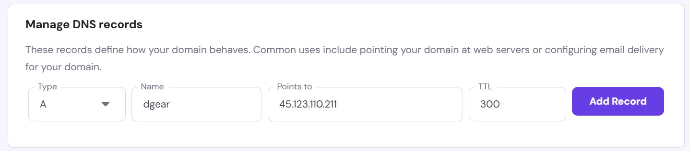

# Server Setup and Bioinformatics Tool Installation Guide

---

## Add User and Groups
```bash
sudo adduser dipayan
sudo passwd dipayan
sudo usermod -aG wheel dipayan
su - dipayan
exit
```

---

## Update and Upgrade System
### Update list and upgreade
```bash
sudo apt update -y
apt list --upgradable
sudo apt upgrade -y
```

### Altogether onetime
```bash
sudo apt update -y && apt upgrade -y
```

---

## Add Cockpit
```bash
sudo systemctl enable --now cockpit.socket
sudo systemctl status cockpit.socket
sudo firewall-cmd --add-service=cockpit --permanent
sudo firewall-cmd --reload
```

---

## Add SSH to Firewall
```bash
sudo firewall-cmd --zone=public --permanent --add-service=ssh
sudo firewall-cmd --reload
```

---

## Install Miniconda (User-specific) and R Environment
```bash
cd Downloads/
wget https://repo.continuum.io/miniconda/Miniconda3-latest-Linux-x86_64.sh
sh Miniconda3-latest-Linux-x86_64.sh
source ~/.bashrc
source /home/ksk/miniconda3/bin/activate
conda init --all

conda create --name r_env r-essentials r-base
conda activate r_env
which R
R
# Inside R console:
# > install.packages("DGEAR")
# > library("DGEAR")
# > q()
conda deactivate
```

---

## Install R Libraries for All Users
```bash
sudo R
# Inside R console:
# > install.packages("BiocManager")
# > BiocManager::install(c("DESeq2", "edgeR", "limma", "metapod"))
# > install.packages("DGEAR")
# > install.packages("ggplot2")
# > install.packages("viridis")
# > install.packages("ggrepel")
# > install.packages("enrichR")
# > BiocManager::install("STRINGdb")
# > 
# >
# >

```

---

## Install, Enable, and Configure Apache (httpd)
```bash
sudo systemctl status httpd
sudo yum install httpd
sudo systemctl start httpd
sudo systemctl enable httpd
sudo systemctl status httpd
sudo nano /etc/httpd/conf/httpd.conf
# Add: ServerName localhost (below ServerAdmin)
sudo systemctl restart httpd
```

---

## Install, Enable, and Configure nginx
### To Install Enable and Start 
```bash
sudo apt install nginx -y
sudo systemctl enable nginx
sudo systemctl start nginx
```
### To check status
```bash
sudo systemctl status nginx
```
### To configure
```bash
sudo nano /etc/nginx/sites-available/compbiosysnbu.in/default
```
##(Optional) Setup SSL (HTTPS) with Let's Encrypt
```bash
sudo apt install certbot python3-certbot-nginx -y
sudo certbot --nginx
```
---

## Install PHP
```bash
sudo yum remove php*
sudo dnf install https://rpms.remirepo.net/enterprise/remi-release-9.rpm
sudo dnf install php php-fpm php-cli php-common php-mbstring php-mysqlnd php-xml php-gd
php -v
sudo systemctl restart httpd
```

---

## Install GROMACS for Simulation
```bash
cd ~/Downloads
wget https://ftp.gromacs.org/gromacs/gromacs-2024.5.tar.gz
tar xfz gromacs-2024.5.tar.gz
cd gromacs-2024.5
mkdir build
cd build
sudo yum install -y cmake
cmake .. -DGMX_BUILD_OWN_FFTW=ON -DREGRESSIONTEST_DOWNLOAD=ON
make
make check
sudo make install
source /usr/local/gromacs/bin/GMXRC
gmx
man gmx
```

---

## Install GROMACS with GPU (CUDA) Support
```bash
cd ~/Downloads/
rm -rf gromacs-2024.5
tar xfz gromacs-2024.5.tar.gz
cd gromacs-2024.5/
mkdir build
cd build/
sudo apt update -y
sudo apt install gcc-11 g++-11
sudo apt upgrade -y
gcc-11 --version
g++-11 --version

cmake .. \
  -DGMX_BUILD_OWN_FFTW=ON \
  -DGMX_GPU=CUDA \
  -DCMAKE_C_COMPILER=gcc-11 \
  -DCMAKE_CXX_COMPILER=g++-11 \
  -DCMAKE_INSTALL_PREFIX=/usr/local/gromacs_gpu

make -j$(nproc)
sudo make install
source /usr/local/gromacs_gpu/bin/GMXRC
gmx --version
```

**Add the following to `~/.bashrc`:**
```bash
source /usr/local/gromacs_gpu/bin/GMXRC
source ~/.bashrc
```

---

## Run Simulation
```bash
gmx mdrun -deffnm md_100ns
gmx mdrun -v -s md_100ns.tpr -cpi md_100ns.cpt -deffnm md_100ns -append
```

---

## Change Ownership of Directories for nginx
```bash
ls -l /var/www/DGEAR/
id www-data
sudo chown -R www-data:www-data /var/www/DGEAR/
sudo systemctl reload nginx
sudo -u www-data /usr/bin/Rscript /var/www/DGEAR/RunCopy.R /var/www/DGEAR/uploads/Example_microarray_data.txt '1' '134' '135' '234' '0.05' '2'
sudo cp /etc/nginx/sites-available/compbiosysnbu.in/default ~/Desktop/ksk/
```

---
## Change Ownership of Directories
### For DGEAR
```bash
sudo chown -R ksk:ksk /var/www/DGEAR/
sudo chown -R www-data:www-data /var/www/DGEAR/
```

---

## Install VSCode, Git and Configure
```bash
sudo dpkg -i ./code_1.99.1-1743784529_amd64.deb
sudo apt install ./code_1.99.1-1743784529_amd64.deb
sudo apt install git
git config --global user.name "koushikbardhan2000"
git config --global user.email "koushikbardhan2000@gmail.com"
git --version
git log
ssh-keygen -C koushikbardhan2000@gmail.com
cat /home/ksk/.ssh/id_ed25519.pub
# Paste this key into GitHub SSH settings
```

---

## DGEAR Web Git Initialization and Changes
```bash
mkdir -p ~/Desktop/ksk/DGEAR
rsync -avh /var/www/DGEAR/ ~/Desktop/ksk/DGEAR/
sudo mount --bind /var/www/DGEAR ~/Desktop/ksk/DGEAR
sudo chown -R ksk:ksk ~/Desktop/ksk/DGEAR
# After changes:
sudo chown -R www-data:www-data ~/Desktop/ksk/DGEAR
```

**Persist Mount Bind:**
```bash
sudo nano /etc/fstab
# Add:
# /var/www/DGEAR  /home/ksk/Desktop/ksk/DGEAR  none  bind  0  0
sudo mount -a
```

---

## Compbiosysnbu Bind Mount
```bash
sudo nano /etc/fstab
# Add:
# /var/www/html  /home/ksk/Desktop/ksk/compbiosysnbu  none  bind  0  0
sudo mount -a
```

---

## Other Useful Changes and Small Commands
```bash
sudo apt install tree screen dirmngr gnupg apt-transport-https ca-certificates software-properties-common htop nvtop -y

rsync -av /var/www/DGEAR/ /home/ksk/Desktop/ksk/DGEAR/

nproc
$(nproc)

# Using screen
screen -ls
screen -S exp
screen -R exp
# ctrl+Z (pause), bg (background job), jobs (show jobs), fg (foreground job), ctrl+A D (detach), ctrl+C (terminate)

# nano editor: Alt+Shift+# for line numbers
```

---
## Install MySQL and phpmyadmin and setup
### Install MySQL Server
```bash
sudo apt install mysql-server -y
sudo mysql
```

```sql
ALTER USER 'root'@'localhost' IDENTIFIED BY '326500';
# or
CREATE USER 'ksk'@'localhost' IDENTIFIED BY '326500';
GRANT ALL PRIVILEGES ON *.* TO 'ksk'@'localhost' WITH GRANT OPTION;
FLUSH PRIVILEGES;
quit;
```
### Install phpMyAdmin
```bash
sudo apt install phpmyadmin -y
```
### Make a Symbolic link to phpmyadmin
```bash
sudo ln -s /usr/share/phpmyadmin /var/www/html
```
---

## Temporary: Add Location for EGRNi Webtool in nginx config
```bash
sudo nano /etc/nginx/sites-available/compbiosysnbu.in/default
```

**Add inside `server {}` block:**
```nginx
location /EGRNi/ {
    root /var/www/;
    index index.php index.html;
    try_files $uri $uri/ /EGRNi/index.php?$args;
}
location ~ ^/EGRNi/.+\.php$ {
    root /var/www/;
    include snippets/fastcgi-php.conf;
    fastcgi_pass unix:/run/php/php8.3-fpm.sock;
    fastcgi_param SCRIPT_FILENAME $document_root$fastcgi_script_name;
    include fastcgi_params;
}
```

---

## Create Sub-domain 
### Add A record as following


### In the hosting server do the rest
```bash
sudo mkdir -p /var/www/demo.compbiosysnbu.in
# This will be the root folder you can also skip the .compbiosysnbu.in part
sudo nano /var/www/demo.compbiosysnbu.in/index.html
# <h1>Hurray!! sub-domain is running!!</h1>
```
Now moving on...
```bash
sudo nano /etc/nginx/sites-available/demo.compbiosysnbu.in
```
Place the following inside `demo.compbiosysnbu.in` and edit your php version accordingly then save the file. 
```bash
server {
    listen 80;
    server_name demo.compbiosysnbu.in;
    root /var/www/demo.compbiosysnbu.in;
    index index.html index.htm index.php;

    location / {
        try_files $uri $uri/ =404;
    }
    location ~ \.php$ {
        include snippets/fastcgi-php.conf;
        fastcgi_pass unix:/run/php/php8.3-fpm.sock;
    }

}

```
Create the Symlink to enable site and restart the nginx 
```bash
sudo ln -s /etc/nginx/sites-available/demo.compbiosysnbu.in /etc/nginx/sites-enabled
sudo nginx -t && sudo systemctl reload nginx

```
### Enable/Install SSL with Certbot
```bash
sudo certbot --nginx -d demo.compbiosysnbu.in
```
check https://demo.compbiosysnbu.in in your browser; it should reflect the message "Hurray!! sub-domain is running!!"
---


### ✅ Subdomain Setup: `dgear.compbiosysnbu.in`

#### ✅ 1. DNS Configuration

You created an A record pointing the subdomain to your server IP:

```
dgear.compbiosysnbu.in → 45.123.110.211
```

---

#### ✅ 2. Nginx Configuration

You created a virtual host file at:

```bash
sudo nano /etc/nginx/sites-available/dgear.compbiosysnbu.in
```

With the following content:

```nginx
server {
    listen 80;
    server_name dgear.compbiosysnbu.in;
    root /var/www/DGEAR;
    index index.html index.htm index.php;

    location / {
        try_files $uri $uri/ =404;
    }

    location ~ \.php$ {
        include snippets/fastcgi-php.conf;
        fastcgi_pass unix:/run/php/php8.3-fpm.sock;
        fastcgi_param SCRIPT_FILENAME $document_root$fastcgi_script_name;
        include fastcgi_params;
    }
}
```
---

#### ✅ 3. Enable the Site and Reload Nginx

```bash
sudo ln -s /etc/nginx/sites-available/dgear.compbiosysnbu.in /etc/nginx/sites-enabled
sudo nginx -t && sudo systemctl reload nginx
```

---

#### ✅ 4. SSL with Certbot

Run the following to configure SSL:

```bash
sudo certbot --nginx -d dgear.compbiosysnbu.in
```

This:

- Configured HTTPS in your Nginx config.
- Set up **auto-renewal** with Certbot.

---

#### ✅ Final Test

- Visit [https://dgear.compbiosysnbu.in](https://dgear.compbiosysnbu.in)
---

## Title
### Sub
```bash

```

---
